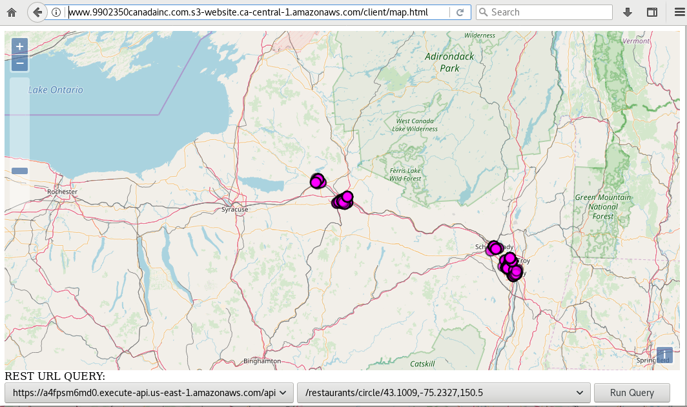

# Chalice GIS Demo https://github.com/mikequentel/chalice-gis-demo

* A reference implementation of a REST-exposed GIS server using AWS Lambda functions generated using Chalice. Includes AWS features such as RDS (for the PostgreSQL database), Lambda (for the FaaS modules), API Gateway for handling requests and responses, VPC (Virtual Private Cloud) which enables proper performance between Lambda and RDS. It is a proof-of-concept and a demo of how one can implement a FaaS GIS server into AWS. It is not meant to be a robust, production-quality solution, but rather an example and potential starting point for future projects.
* Article describing this proof-of-concept: *[Create a FaaS REST GIS in AWS using Open Source Tools](https://www.linkedin.com/pulse/create-faas-rest-gis-aws-using-open-source-tools-mike-quentel)*
* Lambda framework: [Chalice](https://github.com/aws/chalice)
* Database: [PostgreSQL](https://www.postgresql.org)
  * Based on restaurant inspection data, from several years ago (circa 2013), collected by the state of New York and shared at the USA government website [data.gov](https://www.data.gov)
    * This is publicly available information published by the US government.
  * The backend database for this demo does not include PostGIS at this time.
  * Contains a flat table named `restaurants`--not a normalised database, for simplicity of the demo.
* Connection to database: [psycopg2](http://initd.org/psycopg)
* Circle distance calculation uses the libraries [geographiclib](https://pypi.python.org/pypi/geographiclib) and [geopy](https://pypi.python.org/pypi/geopy)

# Interfaces
## Note about the REST interfaces
* At this time, the interfaces are GET (read-only) actions, especially since the proof-of-concept is being publicly hosted.
* The documentation for Chalice framework includes information on [how to include other REST operations](https://chalice.readthedocs.io/en/latest/quickstart.html#tutorial-additional-routing) such as POST, PUT, and DELETE

## Examples of included interfaces--one exists for each field in the database.
* Select top (limit) of items **/restaurants/limit/{limit}** eg: https://a4fpsm6md0.execute-api.us-east-1.amazonaws.com/api/restaurants/limit/100
* Select by object ID **/restaurants/oid/{oid}** eg: https://a4fpsm6md0.execute-api.us-east-1.amazonaws.com/api/restaurants/oid/1441071
* Select by circle (items within the circle), with parameters latitude, longitude, and radius in km **/restaurants/circle/{circle}** eg: https://a4fpsm6md0.execute-api.us-east-1.amazonaws.com/api/restaurants/circle/43.1009,-75.2327,150.5
* Select by bounding box (items within bounding box), with parameters upper left latitude, upper left longitude, lower right latitude, lower right longitude **/restaurants/bbox/43.000000,-79.000000,41.000000,-71.000000** eg: https://a4fpsm6md0.execute-api.us-east-1.amazonaws.com/api/restaurants/bbox/43.000000,-79.000000,41.000000,-71.000000
* Select by facility (restaurant) name **/restaurants/facility/{facility}** eg: https://a4fpsm6md0.execute-api.us-east-1.amazonaws.com/api/restaurants/facility/LITTLE%20ROMA%20PIZZA,%20INC%2E
* Select by county containing facilities of interest **/restaurants/county/{county}** eg: https://a4fpsm6md0.execute-api.us-east-1.amazonaws.com/api/restaurants/county/ONEIDA

## Published on swaggerhub
* Published at: https://app.swaggerhub.com/apis/9902350canada/restaurants/1.0
* Swagger was not used to create the API, but nevertheless the API has been published as an FYI at swaggerhub.com from `swagger/chalice-gis-demo-api-swagger.yaml` which was exported from AWS API Gateway.
* You can ignore the semantic error messages at swaggerhub.com and successfully run tests against the API.

# Hacking

## Prerequisites
* PostgreSQL
* Python (version 2.7 was used for the demo but you could use 3 instead)
* Pip
* Virtualenv
* Chalice

## Steps
1. Clone the Git repository: `git clone https://github.com/mikequentel/chalice-gis-demo.git`
2. Enable the Virtual Environment (via `virtualenv`): `pip install -r requirements.txt`
3. Install a local copy of the database `businesses` which contains the table `restaurants` by using the plain text dump `data/businesses_backup.sql`--example: assuming database named `businesses` already exists (that is, you already created the database), then for user `postgres`, run the command: `psql -U postgres -h localhost --set ON_ERROR_STOP=on businesses < businesses_backup.sql`
4. Set the appropriate credentials, which set environment variables used to connect to the database, in the file `.chalice/config.json`
5. Start the server locally by running `chalice local` which will deploy the server to http://localhost:8000
6. Now, you can run queries against the server through any HTTP client, but most easily through using the example at `client/map.html`
